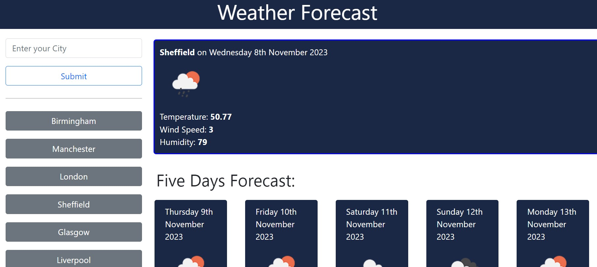

# UBHM-06-your-weather-forecast-app

## Description

This is a weather forecast application which helps the user to be able to determine an immediate forecast for today, as well as a further 5 days after.


## User Story

```
AS A traveler
I WANT to see the weather outlook for multiple cities
SO THAT I can plan a trip accordingly
```

## Acceptance Criteria

```
GIVEN a weather dashboard with form inputs
WHEN I search for a city
THEN I am presented with current and future conditions for that city and that city is added to the search history
WHEN I view current weather conditions for that city
THEN I am presented with the city name, the date, an icon representation of weather conditions, the temperature, the humidity, and the wind speed
WHEN I view future weather conditions for that city
THEN I am presented with a 5-day forecast that displays the date, an icon representation of weather conditions, the temperature, the wind speed, and the humidity
WHEN I click on a city in the search history
THEN I am again presented with current and future conditions for that city
```


## Installation

n/a

## Usage

Please find the source code located here in repository: 
https://github.com/MagMillen-Dutka/UBHM-06-your-weather-forecast-app

Deployed website can be found here: 
https://magmillen-dutka.github.io/UBHM-06-your-weather-forecast-app/


Screenshot:



## Credits

Some of the coding was taken from open-sourced template on Github from user "jnmayhook". Template was adapted and code added to fit the criteria set out as above.

## License

For licensing details please see "LICENSE" details within the repository.

MIT License is used for this project.

